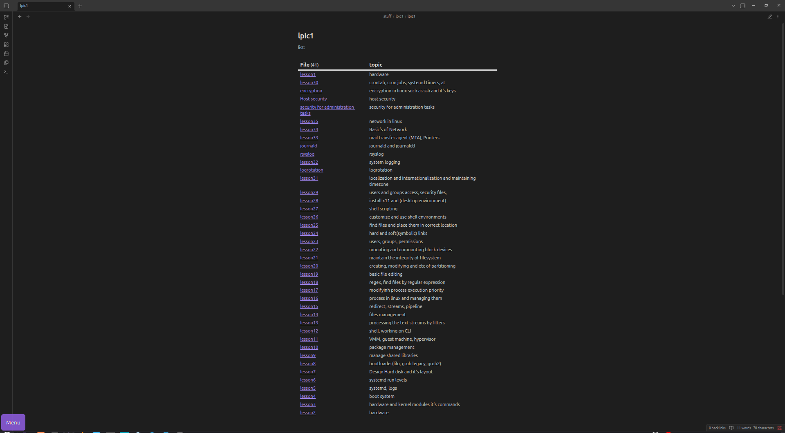

#### This repository contains my personal notes and summaries.
# Contents

> Linux Essentials

> File System Structure

> Permissions (rwx, chmod, chown)

> Processes & System Monitoring

> Package Management (dpkg, apt, rpm, yum)

> systemd & Service Management

> Networking Basics

> Shell & Bash Scripting

> Users & Groups

> Storage, Partitions, and Filesystems

##Usage:
> clone the repo and open the directory by obsidian
## Reference
> jadi's lpic1 playlist --> https://www.youtube.com/watch?v=cqfrsmg4BKo&list=PL-tKrPVkKKE0kM18Sg5fqaZW1V2nidAeU
